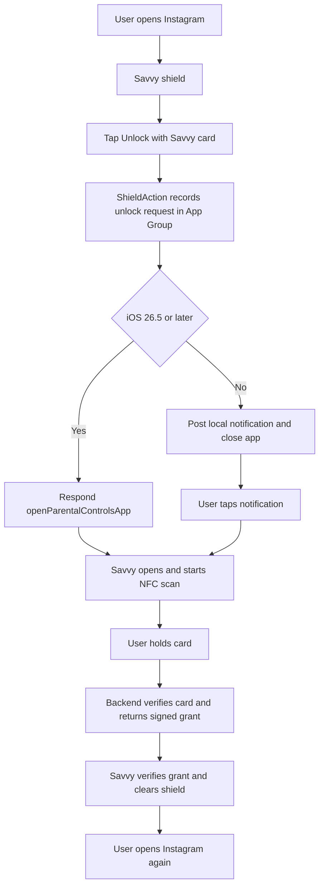
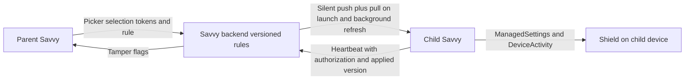

# Savvy iOS Feasibility Report

Research date: 25 September 2026. Current iOS: iOS 26.x (26.5 released), iOS 27 announced at WWDC26.
POC code: `ios/SavvyRDiOS`.
- The non-UI app code and extensions run end to end on Linux against the real backend with framework fakes (`ios/AppHarness`, 8 tests).
- The shared logic is unit-tested (`ios/SavvyCore`, 12 tests).
- It has not yet been built with Xcode or device tested.

Backend proof: `backend/`, 22 automated tests passing.

## How to read this report

Every requirement gets a classification from the R&D brief:

| Code | Meaning |
| --- | --- |
| A | Fully Feasible |
| B | Feasible With OS-Mandated UX Difference |
| C | Feasible With Limitation |
| D | Near-Goal Alternative Available |
| E | Requires External Approval / Entitlement |
| F | Requires Real-Device Validation |
| G | Requires Actual NFC Hardware |
| H | Not Feasible |

Most items carry more than one code. For example, "C + E + F" means it works with a known limitation, needs Apple's entitlement, and still needs a device test.

Evidence levels used below:
- **Official**: Apple documentation, WWDC transcript, or Apple engineer (DTS / Frameworks Engineer) on Apple Developer Forums.
- **Community**: consistent developer reports, not confirmed by Apple.
- **Backend-tested**: proven by automated tests in `backend/test`.
- **Device test pending**: code written, test defined in `IOS_POC_RESULTS.md`, not yet run.

Source shorthand: `docs:` = https://developer.apple.com/documentation/ and `forum:` = https://developer.apple.com/forums/thread/

Important environment note: the R&D environment had no Mac, no iPhone, no Apple Developer account and no NFC cards. Following section 8 of the brief, nothing below is marked Not Feasible because of that. Items that need a device say so.

---

## Summary of the iOS answer

1. **Shielding selected apps works with public APIs** (FamilyControls + ManagedSettings). It needs Apple's Family Controls distribution entitlement for the app and all 4 extensions.
2. **Commitments can run without the app** using DeviceActivity schedules and a monitor extension. They are not a Timer inside the app. There are known reliability reports, so device testing is required.
3. **The NFC card can take part in unlocking, but never silently.** Core NFC works only in the foreground main app.
   - On iOS 26.5 and later, the shield button can open Savvy directly (`openParentalControlsApp`). The flow is then: tap shield button, Savvy opens, hold card. That is about 2 user actions.
   - On older iOS, the flow is: tap shield button, tap notification, hold card. That is about 3 user actions.
   - Background tag reading also works: tap card, tap iOS notification, Savvy validates.
4. **Self-use (.individual) cannot prevent Savvy being deleted.** Apple states this directly. The user can turn off Savvy's Screen Time access in Settings with Face ID or passcode, which removes all restrictions. Savvy can then be deleted.
   - What Savvy can do: add strong friction (`denyAppRemoval` blocks all app deletion until access is revoked), make reinstalling pointless (server keeps the commitment), and detect and record the bypass.
5. **Parent-child (.child) does prevent deletion.** Apple documents that only a parent can delete the app, and the child cannot sign out of iCloud. This requires Family Sharing with a child account.
6. **Parents can choose the child's apps from the parent's own iPhone.** The parent-device picker shows apps from child devices authorized with `.child`. The tokens can be sent to the child device through Savvy's backend. The child device applies the shield.
7. **Screen-time summary can be shown but not stored or uploaded.** Parents cannot see the child's Screen Time report remotely (Apple DTS, June 2026). Savvy's own data (focus time, streaks, emergency exits, bypass flags) can be shared with the parent.

---

## R&D 1. Family Controls entitlement and authorization

**Findings (Official unless marked):**
- `requestAuthorization(for: .individual)` (iOS 16+) shows an alert, then Face ID, Touch ID or device passcode. A passcode must be set on the device, otherwise the error is `authenticationMethodUnavailable`. Source: docs:familycontrols/authorizationcenter, WWDC22 session 110336.
- `.individual` can be used by any number of apps on a device. `.child` can be held by only one app per device (`authorizationConflict`). Source: WWDC22, docs:familycontrols/familycontrolserror.
- `.child` requires:
  - Family Sharing;
  - a child account signed in to iCloud on the device;
  - a parent or guardian in the same family, who approves on the child's device with their Apple Account.

  Source: docs:familycontrols, WWDC21 session 10123.
- Revoking access is possible in two places: Settings > Screen Time > Apps with Screen Time Access, and the per-app "Screen Time Restrictions" switch. Source: WWDC22.
  - For `.individual`, the owner's Face ID or passcode is needed (Community, forum:727291).
  - For `.child`, parent approval is needed (Official).
- On revoke: "the system no longer enforces restrictions", and the selection tokens are voided. Source: docs:familycontrols/authorizationcenter/revokeauthorization(completionhandler:), docs:familycontrols/familyactivityselection.
  - Community reports say `$authorizationStatus` may not emit a change. Savvy must re-check the status on every launch.
- On app deletion: "Apps that have been authorized via FamilyControls are automatically unenrolled upon deletion." Source: Frameworks Engineer, forum:718025.
- Entitlement: `com.apple.developer.family-controls`.
  - Development works immediately.
  - Distribution needs approval, requested at https://developer.apple.com/contact/request/family-controls-distribution.
  - **Each extension bundle ID needs its own request.** Source: docs:familycontrols/requesting-the-family-controls-entitlement.
  - Reported wait: a few days to 4.5 weeks, some longer (Community).

**POC:** `App/Authorization/AuthorizationController.swift` logs every status change. The test lab has buttons for `.individual`, `.child` and revoke.

**Classification:** A + E. Authorization works as documented. Distribution depends on Apple approving 5 bundle IDs (app + 4 extensions).

**Action now:** submit the 5 entitlement requests as soon as bundle IDs are fixed, because this is the longest external dependency.

---

## R&D 2. Application selection

**Findings:**
- `FamilyActivityPicker` returns a `FamilyActivitySelection` holding opaque `ApplicationToken`, `ActivityCategoryToken` and `WebDomainToken` values. It conforms to Codable, so it can be saved in the App Group. Source: docs:familycontrols/familyactivityselection.
- **Savvy cannot read app names or bundle IDs in the main app.** `Label(token)` displays name and icon, but the app cannot read the text. Source: docs:familycontrols/displayingactivitylabels.
  - The ShieldConfiguration extension receives the name and bundle ID, but it is sandboxed and cannot send them out.
  - iOS 26.4 adds real bundle IDs through `.approvedWithDataAccess`, **EU only**, one app per device.
- **Savvy's backend therefore cannot receive a list of the user's installed apps.** It can store the encoded selection only as an opaque blob.
- Tokens are "tokens that devices within the same Family Sharing group can use". They are not portable to unrelated devices. Source: docs:managedsettings/applicationtoken.
- Tokens can change unexpectedly, for example after OS updates (Community, forum:819997).
  - iOS 26.5 adds `ManagedSettingsStore.TokenExpiryMessage` and `refresh(_:)` to handle this (Official).
  - A false-expiry bug is reported fixed in iOS 27 betas (Community).
- On reinstall the saved selection is lost with the app's data. The user must pick apps again. The backend can keep the commitment, but not a usable selection for a new install (the tokens are voided on revoke/delete).

**POC:** `ContentView` "Choose distracting apps" section, `SharedState.selection`.

**Classification:** A for selection on device. C for the limitation that app identity is private and a reinstall needs re-selection. F for token persistence after restart and OS update.

---

## R&D 3. Restrict / shield selected applications

**Findings:**
- `ManagedSettingsStore(named:)` with `shield.applications`, `shield.applicationCategories` and `shield.webDomains`.
  - Up to 50 stores per process, and up to 50 tokens per shield list.
  - The most restrictive setting across stores wins.

  Source: WWDC22, docs:managedsettings/managedsettingsstore.
- Settings stay until the app sets them to nil, or authorization is revoked, or the app is deleted. Survival after app kill, reboot and offline use is widely observed but not stated by Apple (Community). Apple also says "the system doesn't guarantee that the settings you specify govern the device's behavior".
- Messages and some system apps are not covered by category shields (Community). Savvy's own app is exempt from `.all()`.
- Web domains are shielded in Safari and in browsers that report usage through `STWebpageController`. A browser that does not report web usage is a bypass for web shields (Official, docs:deviceactivity/deviceactivityevent). This matters for "Instagram in a browser".
- Siri, Spotlight, notification taps, deep links and Shortcuts "Open App": no Apple statement. The shield is applied by the system when the app comes to the foreground, so these paths are expected to show the shield. **Must be device tested** (T-SHIELD-6).

**POC:** `Shared/ShieldEngine.swift`, `AppModel.start` / `activateLocally`.

**Classification:** A + E + F. This is the core capability of Apple's framework. Persistence and launch-path behaviour must be recorded on device before we commit wording to the client.

---

## R&D 4. Custom shield behaviour

**Findings:**
- ShieldConfiguration can set:
  - blur style;
  - background colour;
  - icon;
  - title and subtitle (text and colour);
  - primary button label and colour;
  - secondary button label.

  iOS 26.4 adds up to 3 secondary-button submenu items. No custom views, and no network in this extension. Source: docs:managedsettingsui/shieldconfiguration.
- ShieldAction responses:
  - `.none`
  - `.close`
  - `.defer` (redraw the shield later)
  - **`.openParentalControlsApp` (iOS 26.5+)**, which opens the app responsible for the shield. Source: docs:managedsettings/shieldactionresponse.
- Before iOS 26.5, Apple said launching the app from ShieldAction is "not currently supported" (forum:719905). The accepted workaround is a local notification that the user taps (Community).
- Core NFC is not available in any extension. Apple DTS, October 2025: "There are no tricks, workaround, or entitlements to make CoreNFC work from an extension." Source: forum:804820.
- Extensions share data through the App Group. Named stores are shared between the app and its extensions (Official).

**Handoff architecture implemented:**

**Classification:** B + F. The shield can be Savvy-branded, and it can hand off to Savvy. The card scan must happen in the Savvy app, and Apple forces this handoff. Whether `openParentalControlsApp` works for `.individual` authorization is not documented and must be tested (T-SHIELD-ACTION-1).

---

## R&D 5. Focus and commitment scheduling

**Findings:**
- DeviceActivity limits: minimum interval 15 minutes, maximum 1 week, maximum 20 monitored activities per app. Source: docs:deviceactivity/deviceactivitycenter/monitoringerror.
  - 6-hour and 24-hour commitments fit.
  - Commitments or task timers shorter than 15 minutes cannot be scheduled directly.
- "The system only invokes intervalDidStart / intervalDidEnd when the device is in use." Source: docs:deviceactivity/deviceactivitycenter.
  - So the release happens when the user next picks up the phone. For Savvy this is acceptable, because the release is only visible when the phone is in use.
- Reliability reports (Community):
  - `intervalDidEnd` is sometimes missed when year/month/day components are used;
  - thresholds fired immediately on iOS 26.0 to 26.4, reportedly fixed in 26.5;
  - the extension may stop being called after many days without the app being opened.
- The monitor extension has about 6 MB memory (Community). It can use the network briefly (Frameworks Engineer, forum:724649).

**Design used in the POC (Shared/ScheduleEngine.swift, Extensions/Monitor):**
1. Start: the app applies the shield immediately, saves the commitment state in the App Group with a monotonic time anchor, and starts a DeviceActivity window for the duration.
2. End: `intervalDidEnd` in the extension clears the shield, even if the app is killed.
3. Backup: on every app launch, the app asks the server for the active commitment and releases or re-applies. So if the extension missed the end, the next Savvy launch fixes it. The danger is only in one direction: the shield staying longer than planned, never ending early.
4. Both schedule component strategies (time-of-day only, and full date) are in the code, so device testing can pick the reliable one (T-SCHED-1, T-SCHED-2).
5. Temporary unlock ("pause") shorter than 15 minutes uses a back-dated 15-minute window that ends at the requested time. Apple documents that callbacks can fire immediately when the interval is already underway. Test T-PAUSE-2.

**Scenarios:**
- **A. Manual start:** covered by the POC.
- **B. 6-hour:** covered by the POC.
- **C. 24-hour:** covered by the POC; full-date components are required above 24 hours.
- **D. Task until completion:** covered by R&D 16.
- **E. Until duration expires:** covered by the POC.

**Classification:** A + F. Supported by design, known community reliability issues, needs device proof across kill, reboot and multi-day idle.

---

## R&D 6. NFC foreground reading

**Findings (Official):**
- `NFCTagReaderSession` (iOS 13+) reads ISO 7816, ISO 15693, FeliCa and MIFARE (Ultralight, Plus, DESFire) tags and exposes the UID.
- `NFCNDEFReaderSession` (iOS 11+) reads the NDEF message only.
- **MIFARE Classic is not supported on iPhone.**
- Entitlement `com.apple.developer.nfc.readersession.formats`: Apple now lists only `TAG`. Info.plist needs `NFCReaderUsageDescription`. Type 4 cards (NTAG 424 DNA) also need `com.apple.developer.nfc.readersession.iso7816.select-identifiers` with `D2760000850101`.
- Always check `readingAvailable`. Only one reader session runs at a time. The session must be started from the foreground app and has a 60-second limit.

**POC:** `App/NFC/NFCReader.swift`. It has both session types and logs chip family, UID, URL and read time for each scan. Test lab buttons: "Scan card (tag session)" and "Scan card (NDEF session)".

**Classification:** A + F + G. Standard, well-documented capability. Read time and reliability with the client's card must be measured.

---

## R&D 7. Background NFC

**Findings (Official, docs:corenfc/adding-support-for-background-tag-reading):**
- iPhone XS and later.
- The system shows a notification for each new tag. After the user taps it, the data goes to the app through a universal link (`NSUserActivityTypeBrowsingWeb`, `ndefMessagePayload`). If the iPhone is locked, the user must unlock first.
- Custom URL schemes are not supported. The first NDEF URI record must be a universal link.
- Not available when:
  - the device has never been unlocked since boot;
  - a Core NFC session is active;
  - Wallet / Apple Pay is in use;
  - the camera is in use;
  - Airplane mode is on;
  - the phone is not "in use".
- If Savvy is not installed, the link opens in Safari (or in an App Clip if configured).
- Behaviour while a shielded app is in front is not documented. Apple's listed exclusions do not mention it, so it probably works, but this must be tested (T-NFC-BG-5).

**Scenario expectations (to be confirmed on device):**

| Scenario | Expected | Actions to unlock |
| --- | --- | --- |
| 1 Savvy foreground | Notification may be suppressed if Savvy is scanning; otherwise notification | Use in-app scan: tap Scan, hold card |
| 2 Savvy background | Notification, tap opens Savvy with the URL | Tap card, tap notification |
| 3 Savvy terminated | Same as background, app launches | Tap card, tap notification |
| 4 Phone locked | Notification, unlock required | Tap card, unlock, tap notification |
| 5 Shield visible | Expected notification (not documented) | Tap card, tap notification |
| 6 Other app active | Notification | Tap card, tap notification |
| 7 Airplane mode | **No background reading** (Official). In-app scan still works (NFC radio is not affected by Airplane mode for in-app sessions: to be confirmed T-NFC-BG-7) | Open Savvy, Scan, hold card |
| 8 Camera open | **No background reading** (Official) | Close camera first |
| 9 Wallet in use | **No background reading** (Official) | Close Wallet first |

**Classification:** B + F. A true one-tap silent unlock is not possible on iOS. Apple forces a notification tap (or an in-app scan). The behavioural goal is still met: the user must physically bring the card to the phone.

---

## R&D 8. NFC to actual restriction unlock

**End-to-end design (implemented in `App/Unlock/UnlockCoordinator.swift` + backend):**
1. The card payload arrives from an in-app scan, background NFC, QR, or a universal link.
2. The payload is parsed. Non-Savvy tags are rejected at once, without the network.
3. Online path:
   - the backend checks that the card is genuine, bound to this account, and allowed by the commitment policy;
   - it returns an Ed25519-signed grant for this device and this commitment;
   - the app verifies the grant and clears the shield.
4. Offline path (signed cards only, configurable): the app verifies the card signature with the embedded public key and checks that the card code equals the bound card. It then clears the shield and queues the release for sync.

**Backend-tested cases (backend/test/api.test.js):**
- valid linked card: releases, with a verifiable grant;
- another user's card: rejected;
- random NFC tag or URL: rejected;
- forged card: rejected;
- replayed NTAG 424 DNA tap: rejected;
- locked commitment: card cannot end it.

**Alternatives compared:**

| Flow | User actions (iOS 26.5+) | User actions (iOS 16 to 26.4) | Notes |
| --- | --- | --- | --- |
| A. Shield button opens Savvy, auto-scan | Tap button, hold card (2) | Tap button, tap notification, hold card (3) | **Recommended.** Works whatever tag type |
| B. Background NFC notification | Tap card, tap notification (2) | Same (2) | Needs universal link domain and iPhone XS+. Not in Airplane mode, camera or Wallet |
| C. User opens Savvy and scans | Open Savvy, tap Scan, hold card (3) | Same (3) | Always-available fallback |
| D. Card tap routes to Savvy first | Same as B | Same as B | B is the only way a tag can route to Savvy |
| E. Shortcuts NFC automation | Tap card (automation runs) + hold card for in-app scan | Same | Setup by user; intent cannot know which tag; can be run by hand. **Only safe for starting focus, never for unlocking alone** |

**Classification:** B + F + G. The end goal is achievable with Apple-mandated extra steps: 2 actions on iOS 26.5+, and 2 to 3 on older iOS. It must be timed on device with the real card (T-UNLOCK-1..10).

---

## R&D 9. NFC card identity and security

See `NFC_FINDINGS.md` for full details. Summary:
- The UID is readable on iOS only through `NFCTagReaderSession`, not through background reading. UIDs are cloneable ("magic" tags). **Do not use the UID as the identity.**
- **Recommended for the MVP:** a signed card URL (Option B) on NTAG215 or NTAG216. It works in background reading, in-app reading, Android and QR. It is verifiable offline. A copy of the URL still works (identity, not possession).
- **Recommended if anti-copy matters:** NTAG 424 DNA with SUN (Option D).
  - Each tap creates a new MAC-protected URL. A backend test proves that replays and clones are rejected, and the verifier matches NXP AN12196's published example.
  - Remaining weakness: "pre-play". The owner can tap the card many times in advance and save the URLs.
  - Full mitigation would be a live AES challenge-response in the Savvy app. This is possible with `NFCISO7816Tag`, but it is more work.
  - Cost is roughly €0.50 to $2.50 per card, compared with about $0.30 for NTAG213 (vendor pages, unverified).

**Classification:** G. The final identity choice needs the client's card and vendor answers.

---

## R&D 10. QR fallback

See `QR_FINDINGS.md`. The QR on the card carries the same URL as the NFC chip, so NFC and QR share one identity.
- The live-camera scanner is in the POC. Photo import is deliberately left out.
- A static QR can be photographed or screenshotted. This proves identity only, not possession (backend test "copied QR ... is accepted").

**Classification:** A for function, C for security. Physical possession is not enforced by a static QR. See alternatives.

---

## R&D 11. Self-use commitment anti-bypass

See `IOS_BYPASS_MATRIX.md` for the full table. Key points:
- **Revoke Savvy's Screen Time access (Face ID or passcode).** All shields and the removal guard disappear. **Savvy cannot prevent this** (Official, Frameworks Engineer, forum:729717). Savvy can detect it on next launch and record it.
- **Delete Savvy.** Blocked while `denyAppRemoval` is on, but only until access is revoked, which is the step above.
- **Reinstall.** The commitment is restored from the server with the same end time (backend-tested). The user must re-authorize and re-select apps, because tokens are voided.
- **Force close / restart / offline.** The shield is expected to persist (Community; device test).
- **Change time.** `requireAutomaticDateAndTime` is set during a commitment, and the monitor extension re-checks with the monotonic clock. Whether iOS honours `requireAutomaticDateAndTime` for `.individual` is unknown (T-TIME-2).

**Classification:** C. The commitment is enforceable against casual bypass. A determined adult can always end it in about 30 seconds in Settings.

---

## R&D 12. Self-use 6/24-hour uninstall delay

**Exact requirement:** once a commitment starts, Savvy cannot be deleted for 6 or 24 hours.

**Approaches investigated:**

| # | Approach | Result |
| --- | --- | --- |
| 1 | FamilyControls `.individual` implicit protection | None. "implicit restrictions for iCloud sign-out and deletion of an app do not apply" (WWDC22, docs) |
| 2 | ManagedSettings `application.denyAppRemoval` | Blocks deleting all apps, but "isn't guaranteed to prevent your app from being deleted with .individual authorization, since .individual authorizations can be revoked at any time via Settings" (Frameworks Engineer, forum:729717) |
| 3 | DeviceActivity to re-apply protection | Cannot re-apply after revoke: all stores are cleared and, by inference, the monitor extension loses authorization too (to confirm in T-SELF-2) |
| 4 | Block the Settings app | No API. Settings cannot be shielded (Community; none documented) |
| 5 | `.child` authorization for an adult | `.child` fails unless the signed-in account is a child in Family Sharing (Official) |
| 6 | MDM `allowAppRemoval=false` | Requires a supervised device. Disables deletion of all apps |
| 7 | MDM managed app `Removable=false` | App must be installed by MDM. User can remove the MDM profile unless supervised through Apple Business Manager. Guideline 5.5 limits MDM to enterprises and some parental-control companies |
| 8 | Screen Time passcode held by a friend | Works with Apple's own Screen Time, not with Savvy. Changes product nature |

**Conclusion:**
- Exact deletion prevention in consumer self-use mode is **not guaranteeable on iOS**. Apple's platform keeps the device owner in control on purpose.
- The MDM and supervision routes are technically possible but commercially unsuitable for a consumer App Store app.

**Strongest near-goal (implemented):**
1. `denyAppRemoval` during the commitment, so the user must first go into Settings and revoke with Face ID.
2. `requireAutomaticDateAndTime` during the commitment.
3. The server keeps the commitment. Reinstall restores it with the same end time.
4. The revoke is detected and recorded (heartbeat reports authorization status, and the streak is broken).
5. Optional product rule: the server can hold a 6-hour or 24-hour "cool-down" before a new commitment can be started without the card. This does not stop deletion, but it makes deletion pointless for the rest of the commitment.

**Classification:** D (near-goal) for self-use. The exact requirement is H for consumer self-use, after the full search above. The client wording must say "Savvy adds a commitment lock that makes removal deliberate and visible", not "Savvy cannot be removed".

---

## R&D 13. Parent / child authorization

**Findings (Official):**
- `.child` must be requested on the child's device. A parent in the same Family Sharing group approves there with their Apple Account.
- Only one app per device can hold `.child`. If the family already uses another third-party parental control app with `.child`, Savvy gets `authorizationConflict`.
- The parent-device `FamilyActivityPicker` "only displays applications and websites from authorized child devices". The child must be `.child` authorized (Frameworks Engineer, forum:723835).
  - If there are several children, their apps are merged in one list and cannot be filtered per child. That is fine for the MVP, which has one child.
- The age cutoff follows Apple's child account rules by region. It is not stated in the Screen Time docs. **Not clear**: this needs confirmation for Savvy's target markets.

**Classification:** A + E + F. Needs two iPhones and a Family Sharing test family.

**Family Sharing is mandatory for the parent-child protections on iOS.**

---

## R&D 14. Parent-to-child architecture

**Apple's intended model** (WWDC21 10123, Official):
1. The guardian authorizes on the child device.
2. The parent device picks the rules.
3. The app sends the rules to the child device through the app's own backend or CloudKit.
4. The child device applies ManagedSettings and DeviceActivity.

There is no Apple relay, and ManagedSettings never runs remotely.

**Savvy architecture (backend-tested sync, device test pending):**

**Answers to the brief's questions:**
- **Are tokens portable?** Within the same Family Sharing group, yes (Official). Developers report that JSON-encoded tokens work when sent to a child device (Community, forum:702260). **Test T-PC-3.**
- **Where must restrictions be applied?** On the child device, by Savvy running there.
- **Offline child.**
  - The child keeps enforcing the last applied rule. The shield and DeviceActivity are local.
  - New rules apply on the next sync. The parent sees "latest rules not applied" and "device not reporting" (backend-tested).
- **Missed push.** The child pulls on every launch and on background refresh, and acknowledges the version (backend-tested).
- **Selection chosen on the child device instead.** Also works, and is simpler for the first version.

**Classification:** A + F. Supported architecture. Token portability must be proven on two iPhones.

---

## R&D 15. Parent / child anti-bypass

**Official protections with `.child`:**
- "only a parent or guardian can delete your app";
- the child "can't sign out of iCloud";
- revoking needs parent approval.

Sources: docs:managedsettings/connectionwithframeworks, docs:familycontrols.

| Behaviour | Self-Use | Parent-Child |
| --- | --- | --- |
| Delete Savvy | Possible after revoking access (Face ID). `denyAppRemoval` adds one step | **Blocked**, parent approval needed (Official) |
| Revoke Screen Time authorization | Possible, owner's Face ID or passcode | **Parent approval needed** (Official; exact UI to be recorded) |
| Restart bypass | Not expected (Community; test) | Not expected (test) |
| Offline enforcement | Shield and schedule are local | Same; new parent rules wait for sync |
| Permission removal | Detected on next launch only | Blocked without parent |
| iCloud sign-out | Allowed | **Blocked** (Official) |
| Change time | `requireAutomaticDateAndTime` (test under .individual) | Same, plus parent can set Screen Time passcode in Apple settings |

**Classification:** A + F for parent-child. The documented protection is genuinely stronger.

---

## R&D 16. To-do restriction integration

- Minimal task model: `App/Tasks/TaskStore.swift`.
- Starting a task starts a commitment in mode `task` with `task_ref`. Completing it calls the backend release with `task_complete` (backend-tested).
- If the task has a duration, DeviceActivity ends it (minimum 15 minutes). If it has no duration, it is capped at 24 hours (a product decision; see OPEN_ITEMS).
- **Product gap:** marking a task "done" is just a tap. In `card_required` mode the POC also requires the card to complete the task (backend-tested). Otherwise the task is a free unlock button. The client must decide.

**Classification:** A + F. The only open point is product policy.

---

## R&D 17. Emergency exit

- Server-side limit per rolling window, configurable (default 2 per 7 days).
  - An optional cooling-off delay is enforced by server time.
  - The action is either "release" or "pause for N minutes".
  - All of this is backend-tested.
- Offline: at most 1 local exit per 7 days, queued for sync.
- After reinstall the count stays, because it is server-side and keyed to the account.
- Race condition: in PostgreSQL, use `SELECT ... FOR UPDATE` on the user row (noted in schema).
- Abuse: repeated emergency exits are visible in the data and can break the streak.

**Classification:** A. The policy numbers are still a product decision.

---

## R&D 18. Screen-time summary

**Findings (Official):**
- Usage data is available only inside the DeviceActivityReport extension, which renders SwiftUI into Savvy's screen. It covers:
  - total duration;
  - per app and per category duration;
  - pickups;
  - notifications;
  - first pickup.
- The report extension "prevents your extension from making network requests or moving sensitive content outside". **Savvy cannot store or upload the numbers.**
- Parent remote view: the docs mention `users: .children`, but Apple DTS (June 2026, forum:834794) says the cross-device data is not exposed to third parties. Plan on the report working only on the device where the usage happened.
- EU only (iOS 26.4+): `.approvedWithDataAccess` allows data export. It is not available in India, the USA and other regions.

| Question | Answer |
| --- | --- |
| Show daily screen time? | Yes, in the report view |
| Usage per selected app? | Yes, in the report view |
| Category usage? | Yes |
| App names and icons? | Yes inside the report only |
| Persist in Savvy? | **No** (outside EU) |
| Upload to backend? | **No** (outside EU) |
| Parent sees child usage remotely? | **No** via Screen Time API. Parent can see Savvy's own data (focus sessions, commitments, emergency exits, tamper flags) |

**POC:** `Extensions/Report`, shown in the test lab.

**Classification:** C for the on-device summary. D for the parent (show Savvy data instead of Screen Time data).

---

## R&D 19. Focus time and streaks

These use normal Savvy data: start, end, outcome, focused seconds and time-zone-aware streak. Both are implemented and backend-tested. Outcomes that count toward the streak are completed, released by card, and task completed. Emergency exit and ending early do not count (configurable).

**Classification:** A.

---

## R&D 20. App Store approval risk

- **Entitlement:** distribution approval for 5 bundle IDs is the main dependency. App Review now flags Screen Time API use without the entitlement (Community).
- **License agreement DPLA 3.3.3(P):**
  - the primary purpose must be family controls or individual focus and productivity;
  - it must not be used "for managing the device of another adult individual" or "in organizational settings";
  - the data can only be used for those controls, and cannot be shared for ads or with data brokers.

  Savvy fits. **Risk:** institute or coaching-centre features (out of MVP scope) could fall under "organizational settings".
- **Guideline 4.10:** "You may not monetize ... Screen Time APIs." Future subscriptions (out of MVP scope) must charge for Savvy's own value, not for access to blocking itself. Careful paywall wording is needed.
- **Guideline 5.1.1 / 5.1.2:** privacy policy, consent, data minimisation, account deletion.
- **Kids:** if the app is listed in the Kids category, guidelines 1.3 / 5.1.4 apply (no third-party analytics or ads). Recommendation: list Savvy for adults and parents, not in the Kids category.
- **NFC usage description and camera usage description:** standard.
- **App Privacy label:** declare the account, card identifier and focus data.

**Classification:** E. The design is technically aligned with public APIs and current App Store requirements. Approval cannot be confirmed before submission.

---

## Section 31. iOS Final Feasibility Matrix

| Requirement | Self-Use iOS | Parent-Child iOS | Evidence | Limitation | Alternative |
| --- | --- | --- | --- | --- | --- |
| App selection | A, E | A, E, F (parent-device picker) | Official docs; POC written | App names private; re-select after reinstall | Select on child device |
| App restriction | A, E, F | A, E, F | Official docs; POC written | Web shield depends on browser support | Shield categories plus Safari domains |
| Restriction survives Savvy kill | F (expected yes) | F (expected yes) | Community; T-SHIELD-3 | Not stated by Apple | App re-applies on launch |
| Restriction survives restart | F (expected yes) | F (expected yes) | Community; T-SHIELD-5 | Not stated by Apple | App re-applies on launch |
| 6-hour commitment | A, F | A, F | DeviceActivity docs; backend-tested server state | intervalDidEnd reliability reports; release happens on next use | App reconciles with server on launch |
| 24-hour commitment | A, F | A, F | Same | Same; full-date components needed | Same |
| NFC foreground read | A, G | A, G | Core NFC docs; POC written | Foreground only; no MIFARE Classic | QR |
| NFC background flow | B, F | B, F | Apple background tag reading doc | Notification tap required; not in Airplane mode, camera, Wallet | In-app scan |
| NFC-based unlock | B, F, G | B, F, G | Backend-tested verification; POC written | 2 to 3 user actions; main app only | Shield button handoff |
| QR unlock | A (function), C (security) | A, C | Backend-tested | Static QR copyable | NTAG 424 DNA for NFC; see QR alternatives |
| Prevent uninstall | D (H for exact) | A (Official) | Apple engineer statement; docs | Revoke then delete | Friction plus server restore plus detection |
| Prevent permission revocation | H (exact), D | A (parent approval) | Official | Owner can always revoke | Detect and record |
| Parent remotely configures rule | N/A | A, F | WWDC21 model; backend-tested sync | Tokens portable within family only | Pick on child device |
| To-do restriction | A, F | A, F | Backend-tested | Task "done" is a tap unless card is required | Card required for completion |
| Emergency exit | A | A | Backend-tested | Offline count local until sync | Parent sees usage |
| Screen-time summary | C | D | Official (report sandbox; DTS) | Cannot store or upload; parent cannot view remotely | Parent sees Savvy data |
| Focus time | A | A | Backend-tested | None | None |
| Streak | A | A | Backend-tested | None | None |
| Offline enforcement | A, F | A, F | Local shield plus DeviceActivity; POC | New rules and SUN cards need network | Signed cards verify offline |
